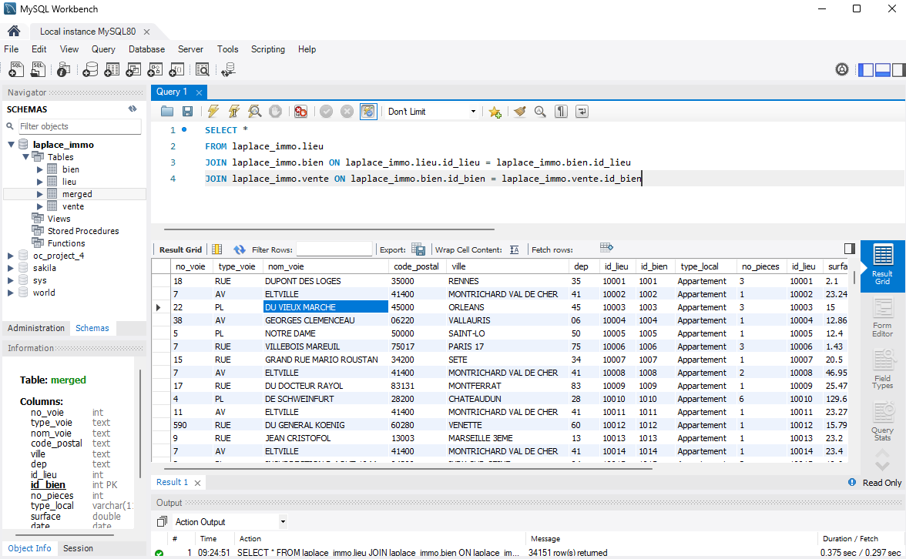
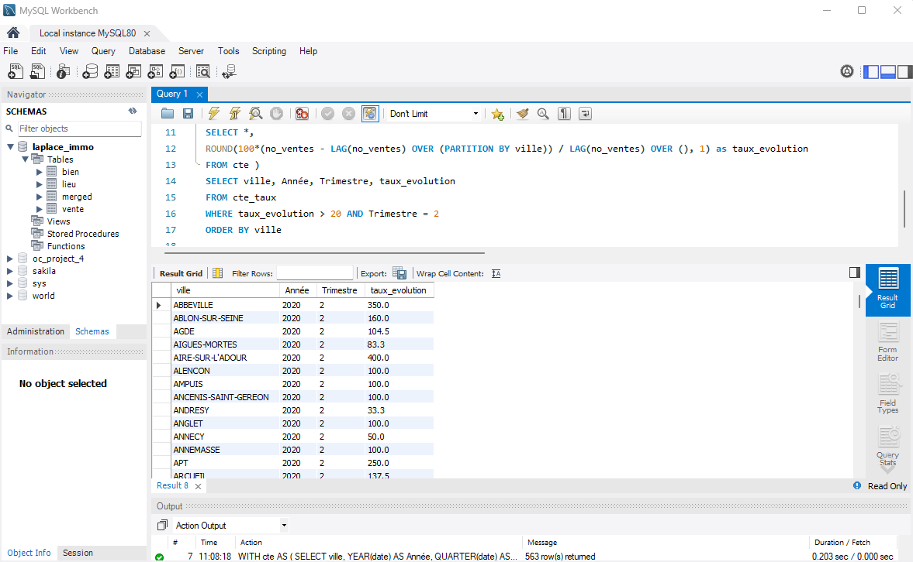

## Analyse des ventes immobilières en France
### Une étude SQL avec les données de LaplaceImmo

### Introduction

Ce projet a été réalisé dans le cadre de mon master en Data Analytics à DSTI. En tant que data analyst, j'ai utilisé MySQL pour mener une analyse approfondie des données immobilières de l'agence Laplace Immo, en me concentrant sur diverses dimensions des ventes immobilières, telles que la répartition géographique, les prix au mètre carré, et l'évolution des ventes au fil du temps. L'objectif était de répondre à des questions spécifiques, en utilisant des techniques avancées de requêtage SQL pour extraire et interpréter les informations clés des données disponibles.

### Objectifs du Projet

L'objectif principal de ce projet était d'analyser les tendances du marché immobilier en France en 2020, en répondant aux questions suivantes à l'aide de requêtes MySQL :

1. [Réaliser une jointure de 3 tables (Lieu, Bien et Vente)](#1)
2. [Nombre total d'appartements vendus au 1er semestre 2020](#2)
3. [Proportion des ventes d'appartements par nombre de pièces](#3)
4. [Liste des 10 départements où le prix du mètre carré est le plus élevé](#4)
5. [Prix moyen du mètre carré d'une maison en Île-de-France](#5)
6. [Liste des 10 appartements les plus chers](#6)
7. [Taux d'évolution du nombre de ventes entre le premier et le second trimestre 2020](#7)
8. [Liste des communes où le nombre de ventes a augmenté d'au moins 20% entre le premier et le second trimestre de 2020](#8)
9. [Différence en pourcentage du prix au mètre carré entre un appartement de 2 pièces et un appartement de 3 pièces](#9)
10. [Les moyennes de valeurs foncières pour le top 3 des communes des départements 6, 13, 33, 59 et 69](#10)

### Démarche et Méthodologie

Dans ce projet, j'ai utilisé les bases de données relationnelles et les requêtes SQL pour extraire, manipuler et analyser les données. La méthodologie adoptée comprend :

- **Exploration des données** : Une première étape d'exploration pour comprendre la structure des données et les relations entre les différentes tables.
- **Jointures SQL** : Application de jointures internes (INNER JOIN) pour combiner les tables et obtenir les données nécessaires pour chaque analyse.
- **Agrégation et Filtrage** : Utilisation de fonctions d'agrégation (COUNT, AVG) et de clauses de filtrage (WHERE, GROUP BY) pour extraire des insights pertinents.
- **Calculs avancés** : Implémentation de sous-requêtes, de CTE (Common Table Expressions), et de fonctions de fenêtre pour des analyses plus complexes, comme les évolutions de tendances et les comparaisons de prix.


### Résultats Clés

- **Volume des Transactions** : Le premier semestre 2020 a vu un nombre significatif de ventes d'appartements, malgré le contexte de la pandémie de COVID-19.
- **Disparités Géographiques** : Les départements avec les prix au mètre carré les plus élevés se concentrent principalement en Île-de-France, reflétant une demande accrue dans cette région.
- **Évolution des Ventes** : Une analyse des tendances de vente a montré une évolution notable entre les trimestres, avec certaines communes enregistrant une augmentation significative des transactions.

### 1. Réaliser une jointure de 3 tables (Lieu, Bien et Vente) <a id='1'></a>
Intégrer les informations des différentes tables pour obtenir une vue unifiée des données immobilières.

Requête:
```sql
SELECT *
FROM laplace_immo.lieu
JOIN laplace_immo.bien ON laplace_immo.lieu.id_lieu = laplace_immo.bien.id_lieu
JOIN laplace_immo.vente ON laplace_immo.bien.id_bien = laplace_immo.vente.id_bien
```




### 2. Nombre total d'appartements vendus au 1er semestre 2020 <a id='2'></a>
Identifier le volume des transactions immobilières pour les appartements au cours du premier semestre 2020.

Requête:
```sql
SELECT 
    YEAR(date) AS Année,
    type_local AS Bien,
    IF(MONTH(date) < 7, 1, 2) AS Semestre,
    COUNT(*) AS No_ventes
FROM laplace_immo.merged
WHERE type_local = 'Appartement'
        AND YEAR(date) = 2020
        AND MONTH(date) < 7
```

Résultat:

| Année | Bien       | Semestre | No_ventes |
|-------|------------|----------|-----------|
| 2020  | Appartement | 1        | 31362     |

### 3. Proportion des ventes d'appartements par nombre de pièces <a id='3'></a>
Analyser la distribution des ventes en fonction du nombre de pièces dans les appartements.

Requête:
```sql
SELECT 
    type_local AS Bien,
    no_pieces,
    ROUND(COUNT(*) *100 / (SELECT COUNT(*) FROM laplace_immo.merged),1) AS '% Ventes'
FROM laplace_immo.merged
WHERE type_local = 'Appartement'
GROUP BY no_pieces
ORDER BY no_pieces
```

Résultat:
| Bien        | Nombre de pièces | % Ventes |
|-------------|------------------|----------|
| Appartement  | 0                | 0.09     |
| Appartement  | 1                | 19.72    |
| Appartement  | 2                | 28.62    |
| Appartement  | 3                | 26.25    |
| Appartement  | 4                | 13.05    |
| Appartement  | 5                | 3.26     |
| Appartement  | 6                | 0.59     |
| Appartement  | 7                | 0.16     |
| Appartement  | 8                | 0.05     |
| Appartement  | 9                | 0.02     |
| Appartement  | 10               | 0.01     |
| Appartement  | 11               | 0.00     |


### 4. Liste des 10 départements où le prix du mètre carré est le plus élevé <a id='4'></a>
Identifier les zones géographiques les plus chères en termes de prix au mètre carré.

Requête:
```sql
SELECT 
    dep AS Departement,
    ROUND(AVG(valeur_fonc / surface)) AS Prix_Mètre
FROM laplace_immo.merged
GROUP BY dep
ORDER BY Prix_Mètre DESC
LIMIT 10
```
Résultat:
| Departement | Prix_Mètre |
|-------------|----------------------|
| 75          | 12052                |
| 92          | 7217                 |
| 94          | 5343                 |
| 06          | 4700                 |
| 74          | 4667                 |
| 93          | 4345                 |
| 78          | 4225                 |
| 69          | 4059                 |
| 20          | 4017                 |
| 33          | 3762                 |


### 5. Prix moyen du mètre carré d'une maison en Île-de-France <a id='5'></a>
Calculer le prix moyen au mètre carré pour les maisons dans les départements de la région Île-de-France.

Requête:
```sql
SELECT 
    dep AS Departement,
    type_local AS Bien,
    ROUND(AVG(valeur_fonc / surface),0) AS Prix_Moyen_Mètre
FROM laplace_immo.merged
WHERE type_local = 'Maison' AND dep IN(75, 92, 93, 94, 77, 78, 91, 95)
GROUP BY departement
ORDER BY Prix_Moyen_Mètre DESC
```
Résultat: 
| Département | Bien  | Prix au mètre carré |
|-------------|-------|----------------------|
| 75          | Maison | 12790                |
| 92          | Maison | 8046                 |
| 94          | Maison | 4280                 |
| 93          | Maison | 4056                 |
| 78          | Maison | 3990                 |
| 95          | Maison | 3142                 |
| 91          | Maison | 3125                 |
| 77          | Maison | 2829                 |


### 6. Liste des 10 appartements les plus chers <a id='6'></a>
Identifier les appartements les plus onéreux en France, en tenant compte du département et de la surface.

Requête:
```sql
SELECT 
    dep AS Departement,
    type_local AS Bien,
    surface,
    valeur_fonc AS Prix
FROM laplace_immo.merged
WHERE type_local = 'Appartement'
ORDER BY prix DESC
LIMIT 10
```
Résultat:
| Département | Bien       | Surface (m²) | Prix     |
|-------------|------------|--------------|----------|
| 75          | Appartement | 9.1          | 9000000  |
| 91          | Appartement | 64           | 8600000  |
| 75          | Appartement | 20.55        | 8577713  |
| 75          | Appartement | 42.77        | 7620000  |
| 75          | Appartement | 253.3        | 7600000  |
| 75          | Appartement | 139.9        | 7535000  |
| 75          | Appartement | 360.95       | 7420000  |
| 75          | Appartement | 595          | 7200000  |
| 75          | Appartement | 122.56       | 7050000  |
| 75          | Appartement | 79.38        | 6600000  |

### 7. Taux d'évolution du nombre de ventes entre le premier et le second trimestre 2020 <a id='7'></a>
Mesurer l'évolution des ventes immobilières entre ces deux périodes.

Requête:
```sql
WITH cte AS (
    SELECT YEAR(date) AS Année,
    QUARTER(date) AS Trimestre,
    count(*) as no_ventes
    FROM
    laplace_immo.merged
    GROUP BY trimestre
    ORDER BY trimestre),
taux AS (
    SELECT Année,
    Trimestre,
    no_ventes,
    ROUND(100*(no_ventes - LAG(no_ventes) OVER ()) / no_ventes, 1) as Taux_evolution
    FROM cte)
SELECT *
FROM taux
WHERE Année = 2020 AND trimestre IN(1,2) AND Taux_evolution is not null
```
Résultat:
| Année | Trimestre | Nombre de ventes | Taux d'évolution (%) |
|-------|-----------|------------------|-----------------------|
| 2020  | 2         | 17382            | 3.5                   |


### 8. Liste des communes où le nombre de ventes a augmenté d'au moins 20% entre le premier et le second trimestre de 2020 <a id='8'></a>
Identifier les zones avec une augmentation significative des ventes.

Requête:
```sql
WITH cte AS (
    SELECT ville,
    YEAR(date) AS Année,
    QUARTER(date) AS Trimestre,
    COUNT(*) AS No_ventes
    FROM laplace_immo.merged
    group by ville, trimestre
    order by ville ),
cte_taux AS (
    SELECT *,
    ROUND(100*(no_ventes - LAG(no_ventes) OVER (PARTITION BY ville)) / LAG(no_ventes) OVER (), 1) as taux_evolution
    FROM cte )
SELECT ville, Année, Trimestre, taux_evolution
FROM cte_taux
WHERE taux_evolution > 20 AND Trimestre = 2
ORDER BY ville
```



### 9. Différence en pourcentage du prix au mètre carré entre un appartement de 2 pièces et un appartement de 3 pièces <a id='9'></a>
Comparer les prix entre différents types d'appartements.

Requête:
```sql
WITH cte AS (
    SELECT type_local,
           no_pieces,
           ROUND(AVG(valeur_fonc / surface), 1) AS Prix_Mètre
    FROM laplace_immo.merged
    WHERE type_local = 'Appartement' AND no_pieces IN (2, 3)
    GROUP BY no_pieces
    ORDER BY no_pieces
),
diff AS (
    SELECT *,
           CASE
               WHEN no_pieces = 2 THEN
                   ROUND(100 * (Prix_Mètre - LEAD(Prix_Mètre) OVER()) / Prix_Mètre, 2)
           END AS Diff_2_3_pieces
    FROM cte
)
SELECT *
FROM diff
WHERE Diff_2_3_pieces IS NOT NULL
```
Résultat:
| Type Local  | Nombre de pièces | Prix au mètre carré | Différence en % |
|-------------|------------------|----------------------|------------------|
| Appartement  | 2                | 4908.6               | 12.4             |

### 10. Les moyennes de valeurs foncières pour le top 3 des communes des départements 6, 13, 33, 59 et 69 <a id='10'></a>
Analyser les communes les plus chères dans certains départements spécifiques.

Requête:
```sql
WITH cte AS (
    SELECT dep,
           ville,
           ROUND(AVG(valeur_fonc), 1) AS Prix_Moyen
    FROM laplace_immo.merged
    WHERE dep IN ('06', '13', '33', '59', '69')
    GROUP BY ville, dep
    ORDER BY dep, Prix_Moyen DESC
)
SELECT dep, ville, Prix_Moyen
FROM (
    SELECT *,
           @count := IF(@dep = dep, @count + 1, 1) AS count,
           @dep := dep
    FROM cte
) top_villes
WHERE count <= 3;
```
Détails :
- @count := IF(@dep = dep, @count + 1, 1) : Utilise une variable de session @count pour compter les lignes dans chaque département. Si la ville appartient au même département que la ville précédente (@dep), @count est incrémenté ; sinon, il est réinitialisé à 1.
- @dep := dep : Met à jour la variable de session @dep avec le département actuel pour la comparaison suivante.
- WHERE count <= 3 : Filtre les résultats pour ne conserver que les 3 villes les plus chères par département.

Résultat:
| Département | Ville                  | Prix Moyen (EUR) |
|-------------|------------------------|------------------|
| 06          | SAINT-JEAN-CAP-FERRAT  | 968750           |
| 06          | EZE                    | 655000           |
| 06          | MOUANS-SARTOUX         | 476898.1         |
| 13          | GIGNAC-LA-NERTHE       | 330000           |
| 13          | SAINT SAVOURNIN        | 314425           |
| 13          | CASSIS                 | 313416.9         |
| 33          | LEGE-CAP-FERRET        | 549500.6         |
| 33          | VAYRES                 | 335000           |
| 33          | ARCACHON               | 307435.9         |
| 59          | BERSEE                 | 433202           |
| 59          | CYSOING                | 408550           |
| 59          | HALLUIN                | 322250           |
| 69          | VILLE SUR JARNIOUX     | 485300           |
| 69          | LYON 2EME              | 455217.3         |
| 69          | LYON 6EME              | 426968.2         |
